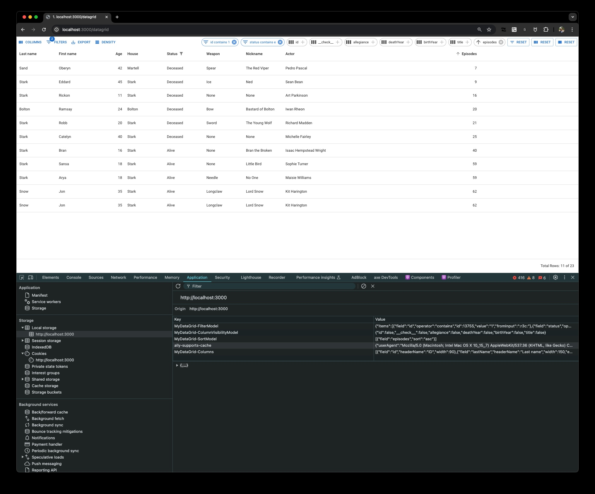

# NextJS / React / MUI

Advanced state management for DataGridPro.

Main objectives:

- [x] persist the column selection
- [z] persist sorting
- [x] persist filter (and ability to combine filters: this is [DataGridPro](https://mui.com/x/react-data-grid/filtering/#single-and-multi-filters) by default)
- [x] persist column order also [DataGridPro](https://mui.com/x/react-data-grid)



## Prerequisites

- node 20

## Local install

- `npm i` - installs dependencies
- `npm run init` - to initialize the `.env.local` file
- `npm start` - starts dev mode

## How is this created

from: https://github.com/mui/material-ui/tree/master/examples/material-ui-nextjs-ts

```sh
curl https://codeload.github.com/mui/material-ui/tar.gz/master | tar -xz --strip=2  material-ui-master/examples/material-ui-nextjs-ts
cd material-ui-nextjs-ts
```

## Resources

- https://mui.com/x/react-data-grid/state/
- https://mui.com/x/react-data-grid/filtering/#controlled-filters
- https://mui.com/x/react-data-grid/filtering/multi-filters/
